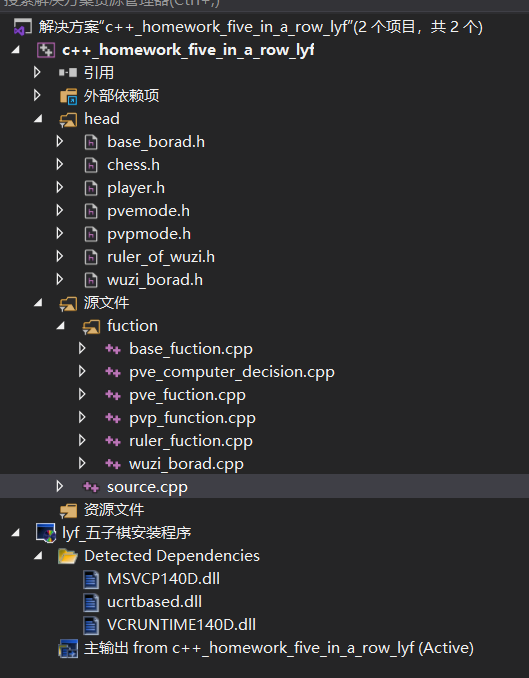

# c++_Home_Work

c++课程作业 五子棋程序，我开源了这门课程的大作业代码，若存在有错误或者不同意见，诚请各位大佬批评指正


### 一、程序目录以及说明 ###




**主程序为source.cpp**

.h是头文件，然后.h里的类方法基本都写到了对应名称的.cpp文件里了。程序大致分为三大部分：

第一部分是基础棋盘和棋子的声明与实现。包含:

base_borad.h   	 基础棋盘类  		  base_function.cpp    基础棋盘类的类方法

wuzi_borad.h    	五子棋类   			 wuzi_borad.cpp      五子棋类的类方法

chess.h         		 棋子类     

player.h        		 玩家类     

ruler_of_wuzi.h    裁判类     				ruler_function.cpp    裁判类的类方法

 

第二部分是人人对战模式的声明与实现。包含:

​    pvpmode.h      人人对战模式类      	pvp_function.cpp 人人对战类的类方法

 

第三部分是人机对战模式的声明与实现。包含:

​    pvemode.h      人机对战模式类    	 pvemode.cpp    人机对战类的类方法

​    pve_computer_decision.cpp    		机器判断落子点的一些类方法。

 


### 二、程序相关类的说明 ### 

1.棋子类:

声明了棋盘上的棋子，方便写游戏的过程栈stack<chess> s_process，用于悔棋

2.玩家类:

​    声明了玩家，用于程序识别当前操作的玩家是人还机器

3.基础棋盘类

声明了棋盘大小，棋盘矩阵和游戏过程栈等棋盘的基础功能。提供了打印棋盘的方法、初始化棋盘的方法。

**4.五子棋类**（继承于基础棋盘类）

提供了五子棋的下棋，禁手方法，悔棋、查询落子位置附件同色棋子数量等类方法。是核心类。

**5.裁判类**       

**声明了本局五子棋棋盘borad**，负责与用户的交互，检测用户输入是否合法，以及执行新游戏的命令。

**6.人人对战模式类**（继承于裁判类）

​       声明了2个玩家，还有当前玩家编号。实现了pvp模式的流程方法。

**7.人机对战模式类** *（继承于裁判类）*   

声明了两个玩家，以及当前玩家标记，玩家选择颜色和难度的信息，博弈树的搜索深度，以及邻近节点栈和邻近节点占用数组（vector）。

由于博弈树本质是dfs，要占用大量的计算资源，所以很多底层的方法我重写在了人机对战模式类里。

类中实现了获取电脑判断落点方法，博弈树算法，落子点打分方法，获取落子点附件棋子情况的方法，获取玩家选择信息方法等。


### 三、一些需要解释的细节。 

   **1、电脑下棋思路：**

遍历当前棋盘上的点，枚举每个点的附近点（|x1-x2|+|y1-y2|<=2的点），放入栈stChess_near。

枚举stChess_near内所有元素，然后利用博弈树（dfs搜索）判断当前落点i和未来nDeep_of_tree-1步的落子得分。

电脑为黑色则分数求最大，为白色则分数求最小（于是所有黑棋对分数的贡献为正数，白棋为负数）

   最终返回stChess_near内位置的最优落子点。


  **2、落子点分数判断函数**

​       这个是写禁手规则时想的。由于电脑下棋也要考虑禁手，而每次判断一次禁手的时间复杂度太大，所以就把禁手规则和得分判断写在了一个函数mode_of_wuzi_pve::get_score里。大概原理就是获取落子点附近的同色棋子数量，然后写很多if else判断禁手和得分。例如下面这段，判断四连的代码：

```c++
if (a[i].first + a[i + 1].first == 3) 
	{
				//such as :●▼●●etc
				if (a[i].second.first != -1) {
					num4++;//四
					if (a[i + 1].second.first != -1)score += 50000;//活4
					else score += 6000;//冲四
				}
				else if (a[i + 1].second.first != -1)score += 6000, num4++;//四
				//else 的情况= 两头都是堵着的=没贡献=score+=0
	}
```

定义了棋子的必胜态，例如黑棋，当形成一个活三+四时，下一步如果白棋没有五连，则黑棋必胜。若仔细查看得分函数的代码，可以发现正常得分都是偶数，所以我把当前是否出现“四”的情况写入了得分score的2进制最后一位：

```c++
if (num3 > 1 || num4 > 1)return -1000000;//禁手
else if (num3 == 1 && num4 == 1)score += 50000;
else if (num3 + num4 == 0)score = score * (num2+1);
```

**3、关于禁手的思考**

​    然后就是禁手的时候思考了很多，之前人人对战时想过的一些禁手情况都写完了，在人机对战时又想到了一些更复杂的禁手情况，或者说禁手情况的判断：例如下图，虽然落子点触发了“双活三”的情况，但是我认为，白子只需要放住落子点最近的两个空白位置其中的任意一个，就把两个活三都拆掉了，所以这里黑棋其实是非必胜的状态，所以我认为这里不应该是禁手，不然太严格了

```c++
if (ty.second.first != -1 && ty.first == 1)score += 800;
//□●□▼●□●□的情况被筛掉了，因为这里是禁手的话，对黑方太严格了
					
```

下图这个状态没有出现在老师的word里，但是我认为这里应该也是禁手状态，因为黑棋凑齐了两个四，且他现在是必胜态。

```c++
if (ty.first == 1 && a[i].second.first != -1) {
		if (tx.second.first != -1 || ty.second.first != -1) score += 200, num2++;//●□▼□□
}
//●●●□▼□●●●算是禁手
```


**3、博弈树** 

  其实就是dfs搜索，但是由于dfs的时空开销太大，于是做了剪枝：

 ①获胜剪枝：如果当前落子点是必胜点，则直接返回，不用再搜索了。

```c++
int ans_score= get_score(now, cloor);
if (ans_score == 1000000 || ans_score == -1000000)return ans_score;
```

②必胜态剪枝：若当前博弈的颜色的对手在上一步没有形成“四”，那么说明下一步对手无法获胜，而下下步当前博弈的颜色必胜。

```c++
if (!last_place_have_4) {//判断上一步的敌人有没有四
			//如果没有四，当到达必胜态时，返回必胜态，不必再dfs
		if (ans_score >= 50000 || ans_score <= -50000) {
			return ans_score;
		}
	}
```

③必败态剪枝：必败的时候就不用继续搜了

```c++
else {//如果上一步有四，
		//首先，现在不可能练成当前棋子颜色的五连，因为连成了就在前面已经返回1e6 or -1e6了
		//那么当前状态无法获胜，只能去堵上一步的四了//于是则只需判断当前落点的位置是否能帮助上一步凑成五连即可，
		//能凑成五连就说明当前位置可以堵住上一步，继续dfs,否则返回必败态
		int ni_s = get_score(now, cloor ? 0 : 1);
		if (ni_s != 1000000 && ni_s != -1000000) {//不能和上步凑成5连
			//返回ans_score+nThe_optimal_scores
			ni_s = cloor ? 10000000 : -10000000;//当前为白，则下一步是黑,+1e6，反则下一步为白，-1e6
			return ans_score+ni_s;
		}
	}
```

④α-β剪枝：当前枚举的位置的得分劣于上层dfs的枚举最优得分时，直接结束本层搜索即可。

```c++
if (cloor)//当前为白棋时，下一层为黑，于是求max
			{
				int scores = dfs_game_tree(i, deep + 1, 0, have_4, nThe_optimal_scores);

				if (nThe_optimal_scores < scores) {//此处是下一层的决策
					ceThe_optimal_chess = i;
					nThe_optimal_scores = scores;
					//本层是白棋，期望是返回的值为最小的，也就是说，
					//上层的last_best_score是上层枚举的当前的最小值
					//而现在在求最大值，那么当nThe_optimal_scores+ans_score>last_best_score时，就不用枚举了,
					//于是我让last-=score , 这里要注意,可能nThe_optimal_scores=last_best_score=-1e7
					if (nThe_optimal_scores > last_best_score)break;
				}

				
			}
```


### 四、总结 

这个作业我是先写完了人人对战模式，然后隔了好久才开始写的人机对战模式。同时因为博弈树需要很高的时空开销，所以把一些博弈树要用到的父类里的方法的核心代码直接重新在博弈树代码所在的.cpp文件里重写了。否则pve_computer_decision.cpp不会那么长。

然后就是禁手的时候想了很多，掉了很多头发。得分机制的参数自己也是手动调了调，大概逻辑就是鼓励电脑往“活三”、四、或者多个二相连的点去走。

但是这样就带来一个问题，黑棋往往倾向于走活三，但是走完他可能又发现自己走到禁手了，于是导致之前电脑判断的落点并不是最优的解。

还有就是“必胜态剪枝”的时候，并不一定保证所有情况都能考虑到，这里是我比较担忧的地方，不过找同学测试了一下发现，绝大多数情况下，这个剪枝还是正确的。

最后就是“困难”模式的电脑思考时间太长的问题，我自己测试的时候一般平均是在10秒钟，电脑就思考完了。但是找同学测的时候，发现当棋局落子过多且空位也多的时候，电脑有少数时间会思考的很久，2分钟之后才会落点，这可能是由于棋局过于复杂的原因所导致的。其实有些地方我想用指针来实现，但是很担心一不小心写出了野指针，所以一个指针都没有加。。。。

另外测试的时候，有时我自己都没发现自己走到了必胜的状态，但是电脑在进行博弈树计算的时候算到了你已经是必胜的状态了，那么电脑就会开始摆烂，下到一些加分多的但是不是阻拦你连成活三或活四的位置，以此来达到必败情况下的总分最高（换句话说就是必会输的情况下，输的分数少一点）

